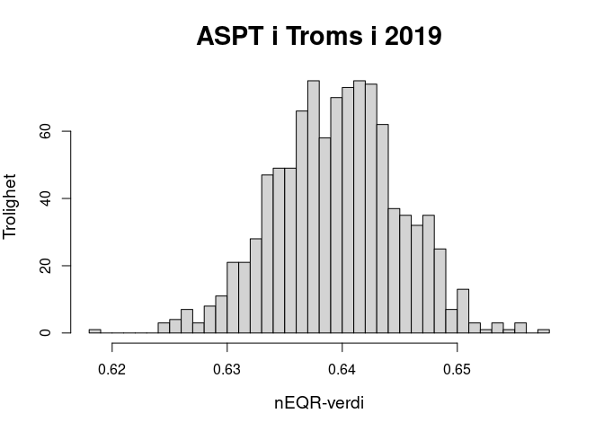
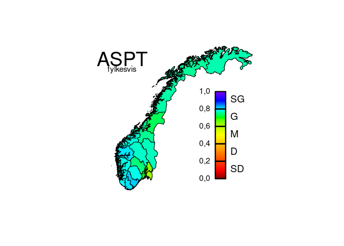
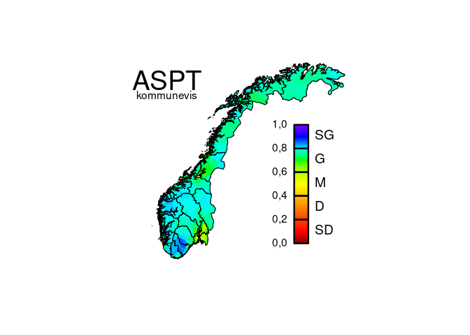

# Dataflyt vannforskrift–naturindeks: eksempel

-   <a href="#forberedelser" id="toc-forberedelser">Forberedelser</a>
-   <a href="#nødvendig-informasjon-om-vannforekomster"
    id="toc-nødvendig-informasjon-om-vannforekomster">Nødvendig informasjon
    om vannforekomster</a>
    -   <a href="#vannforekomster" id="toc-vannforekomster">Vannforekomster</a>
    -   <a href="#nves-innsjødatabase" id="toc-nves-innsjødatabase">NVEs
        innsjødatabase</a>
    -   <a href="#vannlokaliteter" id="toc-vannlokaliteter">Vannlokaliteter</a>
    -   <a href="#kobling-av-informasjon"
        id="toc-kobling-av-informasjon">Kobling av informasjon</a>
    -   <a href="#ytterligere-datafiler"
        id="toc-ytterligere-datafiler">Ytterligere datafiler</a>
-   <a href="#målinger-fra-vannmiljø-databasen"
    id="toc-målinger-fra-vannmiljø-databasen">Målinger fra
    vannmiljø-databasen</a>
-   <a href="#analysen" id="toc-analysen">Analysen</a>
-   <a href="#visualisering" id="toc-visualisering">Visualisering</a>

Flere vannforskrift-parametere inngår også i naturindeksen. Dette
dokumentet viser gangen i å forberede opplasting av data som har blitt
samla inn i rammen av vannforskriften, til naturindeks-databasen.

## Forberedelser

Laste inn nødvendige R-pakker:

    library(foreign)
    library(sf)
    library(readxl)

Laste inn funksjoner:

    source("Funksjon.R")
    source("Vannfork.R")
    source("Klassegr.R")
    source("Dbehandl.R")

## Nødvendig informasjon om vannforekomster

Før vannforskrift-parametere kan analyseres og forberedes for
naturindeksen, må informasjon om vannforekomster og vannlokaliteter
komme på plass. Skal flere vannforskrift-parametere “flyttes over” til
naturindeks, trenger man bare å gjøre dette trinnet én gang. Det
forutsetter at man har lastet ned oppdaterte versjon av disse filene.
Eksempelkoden er basert på datafilene som ble lasta ned i juli 2023.

### Vannforekomster

Fila over vannforekomster må lastes ned som en excel-fil (csv) fra
[vann-nett](https://vann-nett.no/portal/):

`https://vann-nett.no/portal/ > Rapporter > Vanntyper`

Filer for de ulike vannkategoriene må lastes ned hver for seg:

-   Innsjøvannforekomster med vanntypeparametere, påvirkninger,
    tilstand, potensial og miljømål
-   Elvevannforekomster med vanntypeparametere, påvirkninger, tilstand,
    potensial og miljømål
-   Kystvannforekomster med vanntypeparametere, påvirkninger, tilstand,
    potensial og miljømål

For at filene kan leses inn, må de få følgende navn:

-   “**V-L.csv**” for innsjøvannforekomstene
-   “**V-R.csv**” for elvevannforekomstene
-   “**V-C.csv**” for kystvannforekomstene

Man trenger ikke å laste ned alle tre. Det holder med den vannkategorien
som er relevant for vannforskrift-parameteren eller -parameterne.
Benytta vannkategorier må også spesifiseres ved innlesing (se under).

I tillegg trenger man en tabell som forklarer kolonnenavne i fila fra
vann-nett. Denne fila er nødvendig for å lese inn vannforekomstdataene,
og den ligger i dette arkivet under navnet
“[**NavnVN.csv**](NavnVN.csv)”. Hvis vann-nett endrer kolonnenavnene i
sin nedlastingsløsning, må denne fila oppdateres tilsvarende.

Filene leses inn i R på følgende måte:

    V <- lesVannforekomster(c("L", "R", "C"))

    ## 
    ## OBS: Noen vannforekomster har ukjente verdier for alkalitet:
    ## * 16 med "n" = "Ukjent"
    ## Disse blir satt til <NA>!
    ## 
    ## OBS: Noen vannforekomster har ukjente verdier for humusinnhold:
    ## * 16 med "n" = "Ukjent"
    ## Disse blir satt til <NA>!
    ## 
    ## OBS: Noen vannforekomster har ukjente verdier for turbiditet:
    ## * 2 med "0" = "Ikke satt"
    ## * 16 med "n" = "Ukjent"
    ## Disse blir satt til <NA>!
    ## 
    ## OBS: Noen vannforekomster har ukjente verdier for dybde:
    ## * 4 med "7" = "Ukjent middeldyp"
    ## * 16 med "n" = ""
    ## Disse blir satt til <NA>!
    ## 
    ## OBS: Noen vannforekomster har ukjente verdier for turbiditet:
    ## * 1 med "0" = "Ikke satt"
    ## Disse blir satt til <NA>!
    ## 
    ## OBS: Noen vannforekomster har ukjente verdier for salinitet:
    ## * 4 med "0" = "Udefinert"
    ## Disse blir satt til <NA>!
    ## 
    ## OBS: Noen vannforekomster har ukjente verdier for tidevann:
    ## * 2 med "0" = "Udefinert"
    ## Disse blir satt til <NA>!
    ## 
    ## OBS: Noen vannforekomster har ukjente verdier for oppholdstid:
    ## * 2 med "0" = "Udefinert"
    ## Disse blir satt til <NA>!
    ## 
    ## OBS: Noen vannforekomster har ukjente verdier for strøm:
    ## * 2 med "0" = "Udefinert"
    ## Disse blir satt til <NA>!
    ## 
    ## OBS: Noen vannforekomster har ukjente verdier for økologisk tilstand:
    ## * 1115 med "Ikke relevant"
    ## * 17 med "Udefinert"
    ## Disse blir satt til <NA>!
    ## 
    ## OBS: Noen vannforekomster har ukjente verdier for økologisk miljømål:
    ## * 1 med "Udefinert"
    ## Disse blir satt til <NA>!
    ## 
    ## OBS: Noen vannforekomster har ukjente verdier for økologisk potensial:
    ## * 7976 med "Ikke relevant"
    ## * 2 med "Udefinert"
    ## Disse blir satt til <NA>!
    ## 
    ## OBS: Noen vannforekomster har ukjente verdier for økologisk potensial miljømål:
    ## * 7975 med "Udefinert"
    ## Disse blir satt til <NA>!
    ## 
    ## OBS: Noen vannforekomster har ukjente verdier for kjemisk tilstand:
    ## * 2 med ""
    ## * 29706 med "Udefinert"
    ## Disse blir satt til <NA>!

Utmatinga forteller om mindre avvik fra det man kunne forvente. Men
ingen av dem var kritisk for den videre analysen. I så fall hadde
innlesinga blitt avbrutt med beskjeden “FEIL” og en forklaring.

### NVEs innsjødatabase

Fila over Norges innsjøer må lastes ned som en formfil fra
[NVE](http://nedlasting.nve.no/gis/):

`http://nedlasting.nve.no/gis/ > Innsjø > Innsjø`

I menyen må man foreta de følgende valg:

-   kartformat “ESRI shapefil (.shp)”
-   koordinatsystem “Geografiske koordinater ETRS89”
-   utvalgsmetode “Overlapper”
-   dekningsområde “Landsdekkende”

Datasettet man da får, heter “Innsjo\_Innsjo”.

I tillegg trenger man en tabell som forklarer kolonnenavne i fila fra
NVE. Denne fila er nødvendig for å lese inn innsjødataene, og den ligger
i dette arkivet under navnet “[**navnNVEl.csv**](navnNVEl.csv)”. Hvis
NVE endrer kolonnenavnene i sin nedlastingsløsning, må denne fila
oppdateres tilsvarende.

Filnavnet oppgis som parameter når dataene leses inn i R:

    nve <- lesInnsjodatabasen("Innsjo_Innsjo.dbf")

    ## 
    ## OBS: For 3 innsjøer var høyden over havet angitt å være negativ. Disse ble satt til <NA>.
    ## 
    ## OBS: For 4 innsjøer var det norske arealet angitt å være negativ. Disse ble satt til <NA>.
    ## 
    ## OBS: For 1 innsjøer var tilsigsfeltet angitt å være negativ. Disse ble satt til <NA>.
    ## 
    ## OBS: For 589 innsjøer var deres tilsigsfelt angitt å være mindre enn deres areal. For disse ble tilsigsfeltet satt til
    ##      arealet.

Utmatinga forteller om mindre avvik fra det man kunne forvente. Men
ingen av dem var kritisk for den videre analysen. I så fall hadde
innlesinga blitt avbrutt med beskjeden “FEIL” og en forklaring.

### Vannlokaliteter

Fila over vannlokaliteter må lastes ned som en excel-fil (xlsx) fra
[vannmiljø](https://vannmiljo.miljodirektoratet.no/)-databasen:

`https://vannmiljo.miljodirektoratet.no/ > Jeg vil > Søke > Søk i vannlokaliteter`

I fanen “Søk i vannlokaliteter” må man

-   velge riktig “Vannkategori”,
-   trykke “Søk”,
-   trykke “Eksporter”,
-   velge eksporttype “Excel”,
-   trykke “Eksporter til epost”.

Filer for de like vannkategoriene må lastes ned hver for seg. For at
filene kan leses inn, må de få følgende navn:

-   “**VL-L.xlsx**” for innsjøvannlokaliteter
-   “**VL-R.xlsx**” for elvevannlokaliteter
-   “**VL-C.xlsx**” for kystvannlokaliteter

Man trenger ikke å laste ned alle tre. Det holder med den vannkategorien
som er relevant for vannforskrift-parameteren eller -parameterne.
Benytta vannkategorier må også spesifiseres ved innlesing (se under).

I tillegg trenger man en tabell som forklarer kolonnenavne i fila fra
vannmiljø. Denne fila er nødvendig for å lese inn vannforekomstdataene,
og den ligger i dette arkivet under navnet
“[**NavnVL.csv**](NavnVL.csv)”. Hvis vannmiljø endrer kolonnenavnene i
sin nedlastingsløsning, må denne fila oppdateres tilsvarende.

Filene leses inn i R på følgende måte:

    VL <- lesVannlokaliteter(c("L", "R", "C"))

    ## 
    ## OBS: For 13 vannlokaliteter var det oppgitt koordinater som ligger utenfor Norge. Disse koordinatene ble satt til <NA>.

Utmatinga forteller om mindre avvik fra det man kunne forvente. Men
ingen av dem var kritisk for den videre analysen. I så fall hadde
innlesinga blitt avbrutt med beskjeden “FEIL” og en forklaring.

### Kobling av informasjon

Til slutt kan informasjonen om innsjøvannforekomster (fra vann-nett)
utvides med informasjon fra innsjødatabasen (fra NVE). Samtidig testes
det for en rekke mulige feilkilder. Dette trinnet er bare nødvendig om
de(n) aktuelle vannforskrift-parameteren (-parameterne) er relevant for
innsjøer.

    V <- oppdaterVannforekomster(V, nve)

    ## 
    ## OBS: For 277 innsjøer ble størrelsesklassen justert ned basert på deres faktiske areal.
    ## 
    ## OBS: For 25 innsjøer ble høydesonen justert opp basert på deres faktiske høyde over havet.
    ## 
    ## OBS: For 30 innsjøer ble høydesonen justert ned basert på deres faktiske høyde over havet.

Igjen forteller utmatinga om mindre avvik fra det man kunne forvente.
Her gjelder det at typifiseringa av vannforekomstene ikke stemte overens
med størrelse og høyde over havet, slik de fremgår av innsjødatabasen.
Under antagelse av at innsjødatabasen er mer pålitelig enn
vannforekomsttypifisering, har typifiseringa blitt justert for enkelte
vannforekomster.

### Ytterligere datafiler

Viktig informasjon om vannforskrift-parametere og -indekser er samla i
et excel-regneark, som må leses inn.

    Parametere <- as.data.frame(read_xlsx("VM-param.xlsx", na = "NA",
                                           col_types = c("text", "text", 
                                                         "numeric", "numeric")))
    head(Parametere)

    ##          id                                                                   navn min max
    ## 1      ACID                                                               Aciditet  NA  NA
    ## 2   AFANHAB                                   Andre fjæretyper: Andre habitattyper  NA  NA
    ## 3  AFDYPPYT                     Andre fjæretyper: Dype fjærepytter (50 % > 100 cm)  NA  NA
    ## 4 AFGRUNPYT Andre fjæretyper: Brede grunne fjærepytter (> 3 m bred og < 50 cm dyp)  NA  NA
    ## 5  AFMINPYT                                   Andre fjæretyper: Mindre fjærepytter  NA  NA
    ## 6  AFOVHENG                   Andre fjæretyper: Større overheng og vertikalt fjell  NA  NA

Informasjon om de ulike overvåkingsaktivitetene som ligger til grunn for
datainnsamlinga, er også vesentlig. Denne må også leses inn fra et
excel-regneark:

    Aktiviteter <- as.data.frame(read_xlsx("VM-aktiv.xlsx", na = "NA",
                                           col_types = c("text", "text", "numeric")))
    head(Aktiviteter)

    ##     id                               navn skaar
    ## 1 ANLA    Overvåking av anadrom laksefisk     0
    ## 2 ANNE                              Annet     0
    ## 3 AREA     Effekter av planlagt arealbruk    -1
    ## 4 BADE             Overvåking av badevann     1
    ## 5 BAPO  Basisovervåking - påvirka områder    -1
    ## 6 BARE Basisovervåking - referanseforhold     3

Til slutt må det lastes inn en liste over kommuner og fylker.
Informasjonen må være lagret i to excel-regneark som heter
“**knr.xlsx**” og “**fnr.xlsx**”.

    source("AdminEnh.R")

Det tas forbehold om at enkelte målinger kan bli tilordna feil kommune,
i tilfeller der målinger ble tatt i en sammenslått kommune og
tilbakedateres til et tidspunkt før sammenslåinga.

## Målinger fra vannmiljø-databasen

Målingene fra
[vannmiljø](https://vannmiljo.miljodirektoratet.no/)-databasen må også
lastes ned manuelt som excel-fil (xlsx). Det enkleste er å laste ned én
parameter av gangen, og å oppkalle fila etter parameteren. Det gjøres
slik:

`https://vannmiljo.miljodirektoratet.no/ > Jeg vil > Søke > Søk i vannregistreringer og miljøgifter`

I fanen “Søk i registreringer” må man

-   velge riktig “Parameter”,
-   eventuelt avgrense med andre kriterier (f.eks. “Prøvedato”)
-   trykke “Søk”,
-   trykke “Eksport”,
-   velge eksporttype “Redigeringsformat”,
-   trykke “Eksporter til epost”.

I dette eksempelet er målingene for ASPT lasta ned og lagra i fila
“ASPT.xlsx”. Den leses inn slik:

    DATA <- lesMaalinger("ASPT.xlsx")

## Analysen

Når man har kommet hit, kan selve analysen begynne. Den må gjøres
separat for hver vannforskrift-parameter og for hver vannkategori. Hvis
en parameter f.eks. brukes i både innsjøer og elver, må disse analyseres
separat. Som eksempel er ASPT valgt, en bunndyr-forsuringsindeks for
elver.

Analysen består av å

-   koble alle målinger til sine respektive vannforekomster
    naturindeks-rapporteringsår,
-   omregne (skalere) måleverdiene til mEQR-verdier,
-   tilpasse en modell som forklarer variasjonen i måleverdier med
    tidsperiode, typologifaktorer og overvåkingsaktivitet,
-   ekstrapolere trolige verdier til vannforekomster som det ikke
    foreligger målinger fra,
-   simulere usikkerheten (sannsynlighetsfordelinga) for de sistnevnte
    og
-   aggregrere resultatene opp til de ønska administrative enhetene.

Dette trinnet kan ta sin tid. Utmatinger underveis viser progresjonen.
Simuleringa kan ta spesielt mye tid, avhengig av antall iterasjoner. For
illustrasjonen her er det valgt 1000 iterasjoner. For bruk i naturindeks
bør man velge en større verdi (f.eks. 100000).

Funksjonen som gjennomfører analysen, heter `[fraVFtilNI](Dbehandl.R)`
(“fra vannforkrift til naturindeks”). Den har mange flere parametere enn
de som vises under, som tillater ulike justeringer som er [forklart
her](forklar.md). De første fire parametrene må alltid oppgis. Resten
trenger man bare å oppgi om man ønsker å endre på standardinnstillingene
(som også er [forklart her](forklar.md)).

    utmating <- fraVFtilNI(
                           DATA, 
                           vannforekomster = V,
                           vannlokaliteter = VL,
                           parameter = "ASPT",
                           vannkategori = "R",
                           NI.aar = c(1990, 2000, 2010, 2014, 2019, 2024),
                           rapportenhet = c("kommune", "fylke", "landsdel", "norge"),
                           adminAar = 2010,
                           ikkeInkluder = list(typ="tur", vrd=2),
                           ignorerVariabel = "reg",
                           iterasjoner = 1000,
                          )

    ## 
    ##    Innledende tester
    ##    =================
    ## 
    ## De nødvendige datafilene ble funnet. Da setter vi i gang.
    ## 
    ## 
    ##    Lasting av administrative enheter
    ##    =================================
    ## 
    ## De administrative enhetene er på plass. Per 2010 fantes det 19 fylker og 443 kommuner.
    ## 
    ## 
    ##    Undersøkelse av innmatingsdata
    ##    ==============================
    ## 
    ## Det foreligger 15726 målinger av parameteren ASPT [Average Score per Taxon (ASPT)].
    ## 
    ## Alle målinger ble tatt mellom 1984 og 2023.
    ## 
    ## OBS: 7 målinger ligger utafor parameterens definisjonsområde! (Verdiene er mellom 13 og 608.) I tillegg til disse 7 ble
    ##      ytterligere 67 målinger ekskludert, fordi de hadde samme oppdragstaker (COWI, Akvaplan-niva AS) og prøvetakingsdato
    ##      (25.09.2017, 28.08.2018).
    ## 
    ## Vennligst vent mens målingene kobles mot vannforekomster!
    ## Ferdig med 100 % av målingene.
    ## 
    ## OBS: 71 målinger ble ekskludert fordi de ikke kunne knyttes til noen kjent vannlokalitet!
    ## 
    ## OBS: 342 målinger ble ekskludert fordi deres vannlokaliteter ikke kunne knyttes til noen typifisert vannforekomst!
    ## 
    ## OBS: 68 målinger ble ekskludert fordi de ikke ble foretatt i en elvevannforekomst!
    ## 
    ## OBS: 22 målinger ble ekskludert fordi de ble foretatt i en vanntype som parameteren ikke kan brukes i.
    ## 
    ## Dataene som inngår i modelltilpasninga inneholder dermed
    ## - 15149 målinger fra
    ## - 4813 vannlokaliteter i
    ## - 2900 vannforekomster i
    ## - 19 fylker
    ## - mellom 1984 og 2023.
    ## 
    ## 
    ##    Skalering til mEQR-verdier
    ##    ==========================
    ## 
    ## Oppsummering av variabelverdier før skalering:
    ##  minimum ned. kv.   median gj.snitt øvr. kv. maksimum 
    ##    0.000    5.545    6.143    5.988    6.600    9.250 
    ## Oppsummering av variabelverdier etter skalering:
    ## 
    ##  minimum ned. kv.   median gj.snitt øvr. kv. maksimum 
    ##   0.0000   0.4864   0.6357   0.6223   0.7500   1.1516 
    ## 
    ##    Modelltilpasning til målingene
    ##    ==============================
    ## 
    ## 
    ## Modelltilpasning, runde 1:
    ## 
    ## * Aktivitet: KART og KOMM har blitt slått sammen pga. for lite data.
    ## * Aktivitet: ANLA og PASV har blitt slått sammen pga. for lite data.
    ## * Aktivitet: DEPO og TILT har blitt slått sammen pga. for lite data.
    ## * Aktivitet: ANLA+PASV og MYFO har blitt slått sammen pga. for lite data.
    ## * Aktivitet: KART+KOMM og DRIK har blitt slått sammen pga. for lite data.
    ## * Aktivitet: BAPO og BARE har blitt slått sammen.
    ## * Aktivitet: KALK og OEKF har blitt slått sammen.
    ## * Aktivitet: GRUV og VASS har blitt slått sammen.
    ## * Aktivitet: BIOM og RELV har blitt slått sammen.
    ## * Aktivitet: GRUV+VASS og KALL har blitt slått sammen.
    ## * Aktivitet: AREA og FORS har blitt slått sammen.
    ## * Aktivitet: DEPO+TILT og KAVE har blitt slått sammen.
    ## * Aktivitet: BAPO+BARE og KALK+OEKF har blitt slått sammen.
    ## * Aktivitet: GRUV+KALL+VASS og JRBN har blitt slått sammen.
    ## * Aktivitet: DRIK+KART+KOMM og INDU har blitt slått sammen.
    ## * Aktivitet: DEPO+KAVE+TILT og PROB har blitt slått sammen.
    ## * Aktivitet: BIOM+RELV og ELVE har blitt slått sammen.
    ## * Aktivitet: ANNE og GRUV+JRBN+KALL+VASS har blitt slått sammen.
    ## * Turbiditet har blitt beholdt uendra (med 2 ulike verdier).
    ## * Sone har blitt beholdt uendra (med 3 ulike verdier).
    ## * Størrelse: 2 og 3 har blitt slått sammen.
    ## * Størrelse: 4 og 5 har blitt slått sammen.
    ## * Alkalitet: 5 og 6 har blitt slått sammen pga. for lite data.
    ## * Alkalitet: 1 og 8 har blitt slått sammen.
    ## * Alkalitet: 5+6 og 7 har blitt slått sammen.
    ## * Humøsitet har blitt beholdt uendra (med 5 ulike verdier).
    ## 
    ## Modelltilpasning, runde 2:
    ## 
    ## * Aktivitet har blitt beholdt uendra (med 8 ulike verdier).
    ## * Turbiditet har blitt beholdt uendra (med 2 ulike verdier).
    ## * Sone har blitt beholdt uendra (med 3 ulike verdier).
    ## * Størrelse har blitt beholdt uendra (med 3 ulike verdier).
    ## * Alkalitet har blitt beholdt uendra (med 5 ulike verdier).
    ## * Humøsitet har blitt beholdt uendra (med 5 ulike verdier).
    ## 
    ## Call:
    ## vrd ~ per * rar + akt + son + stø + alk + hum + tur
    ## 
    ## Weighted Residuals:
    ##      Min       1Q   Median       3Q      Max 
    ## -1.07497 -0.03467 -0.00306  0.02795  1.06369 
    ## 
    ## Coefficients:
    ##                              Estimate Std. Error t value Pr(>|t|)    
    ## (Intercept)                  0.340721   0.422050   0.807   0.4195    
    ## per2000                      0.520116   0.423857   1.227   0.2198    
    ## per2010                      0.750875   0.421415   1.782   0.0748 .  
    ## per2014                      0.437619   0.421578   1.038   0.2993    
    ## per2019                      0.535027   0.421367   1.270   0.2042    
    ## per2024                      0.414380   0.421416   0.983   0.3255    
    ## rar                         -0.095175   0.109686  -0.868   0.3856    
    ## aktANNE+GRUV+JRBN+KALL+VASS -0.138313   0.015113  -9.152  < 2e-16 ***
    ## aktAREA+FORS                -0.260693   0.017643 -14.776  < 2e-16 ***
    ## aktBAPO+BARE+KALK+OEKF      -0.214242   0.017083 -12.541  < 2e-16 ***
    ## aktBIOM+ELVE+RELV           -0.068053   0.015666  -4.344 1.41e-05 ***
    ## aktDEPO+KAVE+PROB+TILT      -0.120223   0.015838  -7.591 3.37e-14 ***
    ## aktDRIK+INDU+KART+KOMM      -0.304626   0.016914 -18.010  < 2e-16 ***
    ## aktLANG                      0.067530   0.017018   3.968 7.28e-05 ***
    ## sonL                         0.008867   0.010105   0.878   0.3802    
    ## sonM                         0.065829   0.010233   6.433 1.29e-10 ***
    ## stø2+3                       0.024977   0.003828   6.525 7.03e-11 ***
    ## stø4+5                      -0.002545   0.006709  -0.379   0.7045    
    ## alk2                        -0.036184   0.005473  -6.611 3.94e-11 ***
    ## alk3                        -0.082331   0.006080 -13.541  < 2e-16 ***
    ## alk4                        -0.259091   0.008783 -29.501  < 2e-16 ***
    ## alk5+6+7                     0.030197   0.007065   4.274 1.93e-05 ***
    ## hum1                         0.011271   0.015952   0.707   0.4799    
    ## hum2                        -0.024818   0.015439  -1.607   0.1080    
    ## hum3                        -0.189862   0.020991  -9.045  < 2e-16 ***
    ## hum4                        -0.023652   0.018861  -1.254   0.2098    
    ## tur3                        -0.151728   0.012335 -12.301  < 2e-16 ***
    ## per2000:rar                  0.086281   0.111963   0.771   0.4409    
    ## per2010:rar                  0.109437   0.109708   0.998   0.3185    
    ## per2014:rar                  0.067978   0.109787   0.619   0.5358    
    ## per2019:rar                  0.113002   0.109713   1.030   0.3030    
    ## per2024:rar                  0.080597   0.109713   0.735   0.4626    
    ## ---
    ## Signif. codes:  0 '***' 0.001 '**' 0.01 '*' 0.05 '.' 0.1 ' ' 1
    ## 
    ## Residual standard error: 0.127 on 15117 degrees of freedom
    ## Multiple R-squared:  0.348,  Adjusted R-squared:  0.3467 
    ## F-statistic: 260.3 on 31 and 15117 DF,  p-value: < 2.2e-16
    ## 
    ## 
    ##    Ekstrapolering til ikke-målte vannforekomster
    ##    =============================================
    ## 
    ## Det fins 23343 typifiserte elvevannforekomster.
    ## Av disse har 23095 vannforekomster en vanntype som parameteren ASPT er definert for.
    ## Det foreligger altså målinger for 13% av de relevante vannforekomstene (2900 av 23095).
    ## 
    ## 
    ##    Simulering
    ##    ==========
    ## 
    ## Nå begynner simuleringa. Det er valgt 1000 iterasjoner.
    ## Ferdig med 100% av simuleringene.
    ## Ferdig med 443 av 443 kommuner.
    ## 
    ## Sånn. Da har vi omsider kommet i mål.

## Visualisering

Her kommer noen eksempler på visualiseringer av resultatene. For det
første kan man plotte den simulerte sannsynlighetsfordelinga som et
histogram, f.eks. slik:

    hist(utmating$fylke["1900", 6, ], 
         breaks=36, 
         main="ASPT i Troms i 2019", 
         xlab="nEQR-verdi", 
         ylab="Trolighet", 
         cex.lab=1.2, cex.main=1.8)

De fylkesvise gjennomsnittsresultatene kan vises på kart:

    library(raster)
    load("norge.map")
    plot(Norge.fylker, asp = 2.1)
    text(6, 70, "ASPT", cex = 2.4, font = 1.6)
    text(6, 69, "fylkesvis", cex = 0.96)
    for (i in dimnames(utmating$fylke)$fylke) {
      plot(Norge.fylker[which(Norge.fylker@data$NAME_1 == fylke(i)), ],
           col=farge(min(1, utmating$fylke[i, "2019", 1])), add = T)
    }
    for (i in seq(0, 0.999, 0.001)) {
      rect(24, 59+i*8, 26, 59+(i+0.001)*8, col = farge(i), border = farge(i))
      }
    for (i in 1:5) {
      rect(24, 59+(i-1)*1.6, 26, 59+i*1.6, col = NA, border = T, lwd = 2.4)
    }
    text(rep(24, 6), 59+0:5*1.6, c("0,0", "0,2", "0,4", "0,6", "0,8", "1,0"), 
         pos = 2, cex = 0.96)
    text(rep(26, 5), 59.8+0:4*1.6, c("SD", "D", "M", "G", "SG"), pos = 4, cex = 1.2)

Det samme gjelder de kommunevise resultatene:

    plot(Norge.kontur, asp = 2.1, col = grey(0.84))
    text(6, 70, "ASPT", cex = 2.4, font = 1.6)
    text(6, 69, "kommunevis", cex = 0.96)
    for (i in dimnames(utmating$kommune)$kommune) {
      for (kmn in kommunehistorikk[which(kommunehistorikk[, "2008"] == i), "1992"]) {
        plot(Norge.kommuner[which(Norge.kommuner@data$NAME_2 == kmn),], 
             col=farge(min(1, utmating$kommune[i, "2019", 1])), border = NA, add = T)
      }
    }
    plot(Norge.fylker, add = T)
    for (i in seq(0, 0.999, 0.001)) {
      rect(24, 59+i*8, 26, 59+(i+0.001)*8, col = farge(i), border = farge(i))
      }
    for (i in 1:5) {
      rect(24, 59+(i-1)*1.6, 26, 59+i*1.6, col = NA, border = T, lwd = 2.4)
    }
    text(rep(24, 6), 59+0:5*1.6, c("0,0", "0,2", "0,4", "0,6", "0,8", "1,0"), 
         pos = 2, cex = 0.96)
    text(rep(26, 5), 59.8+0:4*1.6, c("SD", "D", "M", "G", "SG"), pos = 4, cex = 1.2)

