# Beregning av mEQR-verdier

En rekke vannforskriftsparametere kan få måleverdier som er _bedre_ enn **referanseverdien** (beste grense for svært god tilstand) eller _dårligere_ enn "**nullverdien**" (dårligste grense for svært dårlig tilstand).
Standardprosedyren ifølge vannforskriften ([veileder 02:2018](https://www.vannportalen.no/veiledere/klassifiseringsveileder/), s. 37) er å trunkere slike måleverdier, slik at de førstnevnte får en nEQR-verdi på 1 og de sistnevnte en nEQR-verdi på 0.
For å estimere usikkerhet i naturindeksen er det derimot viktig å ikke skjule denne variabiliteten i måleverdier.
Derfor har Sandvik ([2019](http://hdl.handle.net/11250/2631056), s. 13&ndash;15) foreslått å beregne "mEQR-verdier", som bare skiller seg fra nEQR-verdier i at de ikke blir trunkert.

Imidlertid forutsetter denne løsninga at man besvarer et oppfølgingsspørsmål:
Hvilken transformasjon skal man bruke på de overskytende verdiene (bedre enn referanseverdi eller dårligere enn nullverdi) for å skalere dem til mEQR-skala?
Svaret er ikke gitt i vannforskriften (som jo unngår spørsmålet ved trunkering), og det er heller ikke trivielt.
Løsninga som nå er implementert i funksjonen [`mEQR`](mEQR.md), tar utgangspunkt i formelen for nEQR:

$$\mathrm{nEQR} = S_{\mathrm{n}} + \mathrm{0,2} \cdot \displaystyle \frac{x - V_{\mathrm{n}}}{V_{\mathrm{ø}} - V_{\mathrm{n}}} $$

der _S_n er den nedre terskelverdien for den respektive tilstandsklassen på nEQR-skala, _V_n er den nedre terskelverdien for den respektive tilstandsklassen på parameterens opprinnelig måleskala, _V_ø er den øvre terskelverdien for den respektive tilstandsklassen på parameterens opprinnelig måleskala, og _x_ er parameterens måleverdi.

Beregning av mEQR følger beregning av nEQR for alle måleverdier mellom null- og referanseverdi.
For de øvrige måleverdiene er beregninga slik:

- I utgangspunktet brukes samme transformasjon (dvs. samme stigningstall) som den tilstøtende tilstandsklassen. Det vil si at mEQR for måleverdier som er bedre enn referanseverdien, beregnes med samme formel som måleverdier i svært god tilstand (med _S_n = 0,8 og _V_ø = referanseverdien), og mEQR for måleverdier som er dårligere enn nullverdien, beregnes med samme formel som måleverdier i svært dårlig tilstand (med _S_n = 0,0 og _V_n = nullverdien).
- Hvis denne verdien imidlertid er større enn 1,2 eller mindre enn &minus;0,2, erstattes den lineære transformasjonen med en asymptotisk funksjon som begynner med samme stigningstall som i den tilstøtende tilstandsklassen, og som har 1,2 som sin høyeste verdi (for måleverdier som er bedre enn referanseverdien) eller &minus;0,2 som sin laveste verdi (for måleverdier som er dårligere enn nullverdien).

## Illustrasjoner

De følgende figurene illustrerer hvordan skaleringa fra måleverdi til mEQR-verdi ser ut for de [tolv parametrene som er klargjort for dataflyt](param.md) (der fargene symboliserer tilstand &ndash; _lilla:_ bedre enn referanseverdien, _blå:_ svært god, _grønn:_ god, _gul:_ moderat, _oransje:_ dårlig, _rød:_ svært dårlig, _grå:_ dårligere enn nullverdien):

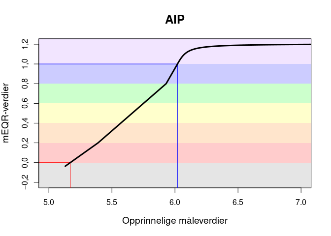 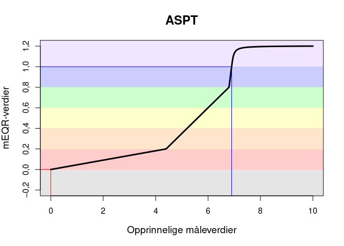

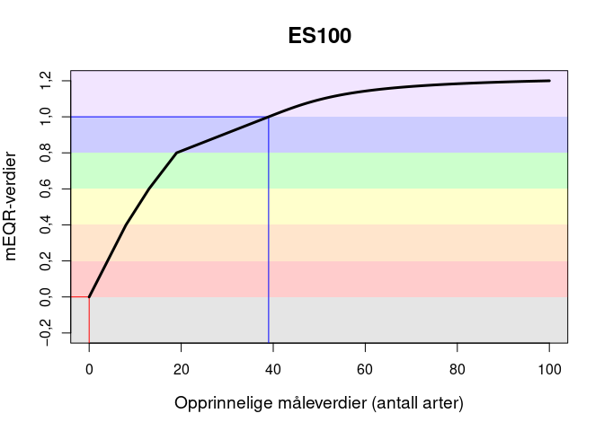 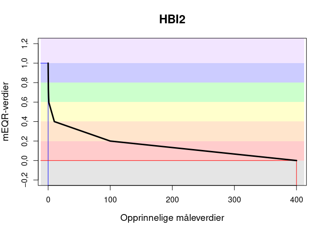

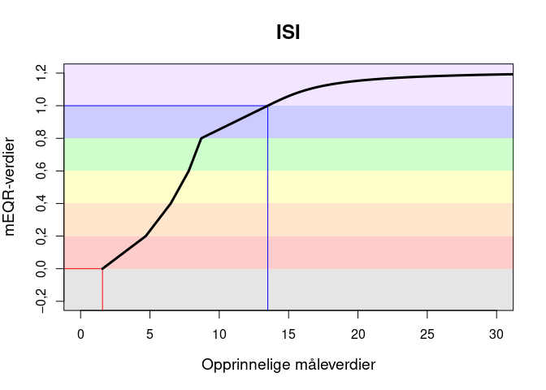 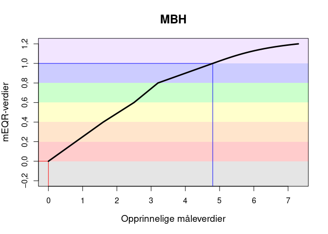

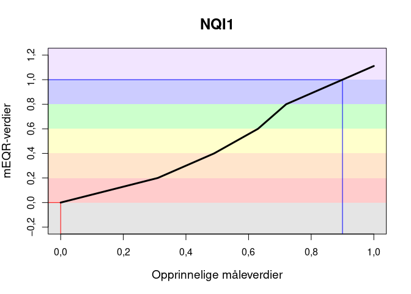 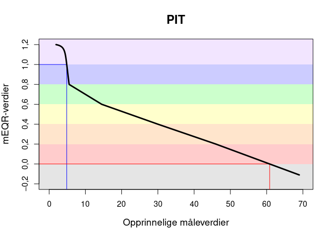

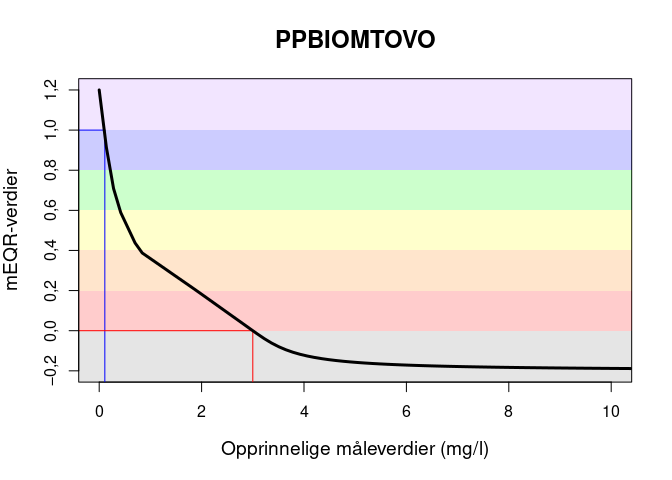 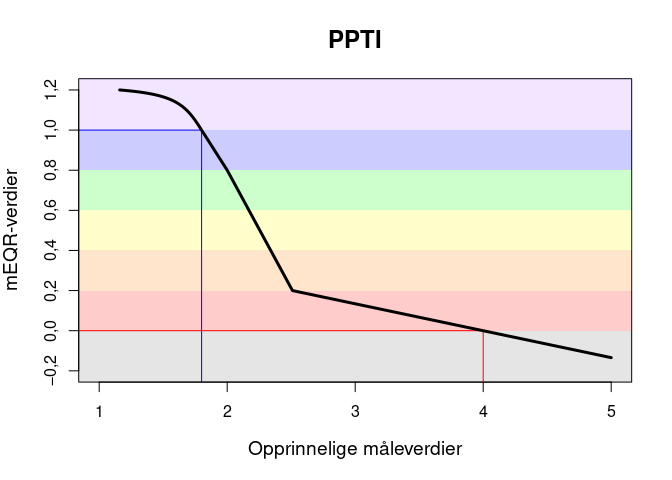

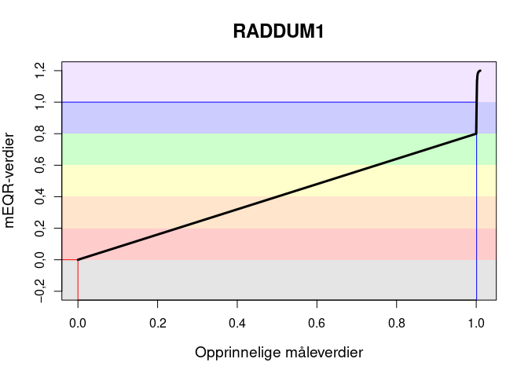 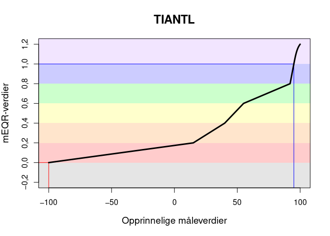

Der ikke annet er oppgitt, er de opprinnelige måleverdiene enhetsløse indeksverdier.

## Begrunnelse

## Alternative beregningsmåter

Den følgende figuren bruker PTI for å illustrere ulike måter å håndtere overskytende verdier på:

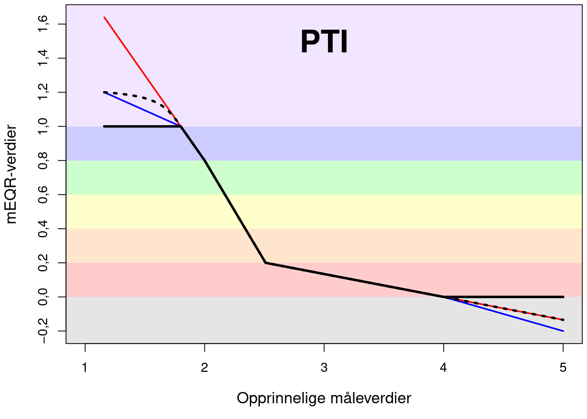

1. _Gjennomtrukket svart linje:_ nEQR. Vannforskriftens tilnærming er å trunkere EQR-verdier som er større enn 1, til 1, og de som er mindre enn 0, til 0. Ulempen ved bruk av denne tilnærminga for f.eks. naturindeksen er at informasjon om parameterens variasjon går tapt.
2. _Rød linje:_ lineær forlengelse av transformasjonene som er valgt for de tilstøtende tilstandsklassene. Ulempen er at tilnærminga kan resultere i verdier som er vesentlig mye større enn 1 eller vesentlig mye mindre enn 0. Et gjennomsnitt av to målinger tilsvarende beste mulige verdi (1,64) og nullverdi (0,00) ville f.eks. resultere i svært god tilstand (0,82), noe som er villedende.
3. _Blå linje:_ lineær begrensning til intervallet mellom &minus;0,2 og +1,2. Dette er løsninga som ble foreslått av Sandvik ([2019](http://hdl.handle.net/11250/2631056)) og var implementert i tidligere versjoner av koden (til og med versjon 1.1). Et gjennomsnitt av to målinger tilsvarende beste mulige verdi (1,2) og nullverdi (0,0) ville f.eks. resultere i moderat tilstand (0,6), noe som er akseptabelt. Ulempen er at tilnærminga leder til uheldige knekk ved 1 og 0.
4. _Punktert svart line:_ forlengelse av transformasjonene som er valgt for de tilstøtende tilstandsklassene, men med en asymptotisk begrensning til intervallet mellom &minus;0,2 og +1,2 (om nødvendig). Dette er løsninga som nå er implementert i koden (fra og med versjon 1.2).

