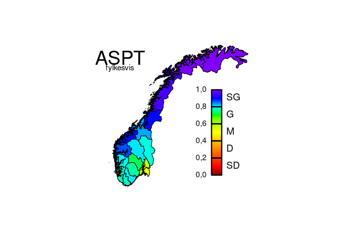

# Illustrasjon av dataflyt fra vannforskrift til naturindeks

Dette dokumentet viser gangen i å forberede og gjennomføre opplasting av
data som har blitt samla inn i rammen av vannforskriften, til
naturindeks-databasen.

-   [Forberedelser](#forberedelser)
-   [Nødvendig informasjon om
    vannforekomster](#nødvendig-informasjon-om-vannforekomster)
    -   [Vannforekomster](#vannforekomster)
    -   [NVEs innsjødatabase](#nves-innsjødatabase)
    -   [Vannlokaliteter](#vannlokaliteter)
    -   [Kobling av informasjon](#kobling-av-informasjon)
    -   [Ytterligere datafiler](#ytterligere-datafiler)
-   [Målinger fra
    vannmiljø-databasen](#målinger-fra-vannmiljø-databasen)
-   [Analysen](#analysen)
-   [Visualisering](#visualisering)
-   [Opplasting til
    naturindeks-databasen](#opplasting-til-naturindeks-databasen)

## Forberedelser

Laste inn nødvendige **R**-pakker:

    library(foreign)
    library(sf)
    library(readxl)
    library(raster)
    library(NIcalc)

Laste inn funksjoner:

    source("R/Funksjon.R")
    for (filnavn in list.files("R", full.names = TRUE)) {
      source(filnavn)
    }

## Nødvendig informasjon om vannforekomster

Før vannforskrift-parametere kan analyseres og forberedes for
naturindeksen, må informasjon om vannforekomster og vannlokaliteter
komme på plass. Det forutsetter inntil videre at man manuelt har lasta
ned oppdaterte versjoner av disse filene. Skal flere
vannforskrift-parametere “flyttes over” til naturindeks, trenger man
bare å gjøre dette trinnet én gang. Eksempelkoden er basert på
datafilene som ble lasta ned i juli 2023.

### Vannforekomster

Informasjon om vannforekomstenes (1) beliggenhet og deres (2) typologi
må lastes ned separat.

1.  Data over vannforekomstenes beliggenhet må lastes ned som formfil
    (gdb) fra Miljødirektoratet
    (<https://karteksport.miljodirektoratet.no/>). I menyen må man
    foreta de følgende valg:

    -   Produkt: “Vannforekomster”
    -   Definer område: “nasjonalt”
    -   Format: “ESRI Filgeodatabase (ESPG:4326)”

    Datasettet man da får tilsendt per e-post, må dekomprimeres og døpes om
til “**VF.gdb**”.

2.  Filer over vannforekomstenes typologi må lastes ned som excel-filer
    (csv) fra [vann-nett](https://vann-nett.no/portal/):

    `https://vann-nett.no/portal/ > Rapporter > Vanntyper`

    Filer for de ulike vannkategoriene må lastes ned hver for seg:

    -   Innsjøvannforekomster med vanntypeparametere, påvirkninger,
    tilstand, potensial og miljømål
    -   Elvevannforekomster med vanntypeparametere, påvirkninger, tilstand,
    potensial og miljømål
    -   Kystvannforekomster med vanntypeparametere, påvirkninger, tilstand,
    potensial og miljømål

    For at filene kan leses inn, må de gis følgende navn:

    -   “**V-L.csv**” for innsjøvannforekomstene
    -   “**V-R.csv**” for elvevannforekomstene
    -   “**V-C.csv**” for kystvannforekomstene

    Man trenger ikke å laste ned alle tre. Det holder med den vannkategorien
som er relevant for vannforskrift-parameteren eller -parameterne.
Benytta vannkategorier må også spesifiseres ved innlesing (se under).

    I tillegg trenger man en tabell som forklarer kolonnenavne i fila fra
vann-nett. Denne fila er nødvendig for å lese inn vannforekomstdataene,
og den ligger i dette arkivet under navnet
“[**navnVN.csv**](data/navnVN.csv)”. Hvis vann-nett endrer
kolonnenavnene i sin nedlastingsløsning, må denne fila [oppdateres
tilsvarende](forklar/hjelpfil.md#vannforekomster-v-.csv-navnvn.csv).

De nødvendige filene er plassert i mappa “[data](data/)”. De leses da
inn i **R** ved hjelp av funksjonen
[`lesVannforekomster`](forklar/lesVannforekomster.md) på følgende måte:

    V <- lesVannforekomster(c("L", "R", "C"))

    ## 
    ## OBS: Noen vannforekomsters dybde ble justert:
    ## * 6 ganger fra 5 til 2
    ## 
    ## OBS: Noen vannforekomsters humøsitet ble justert:
    ## * 226 turbide brepåvirka vannforekomster ble satt til "klar"
    ## * 81 turbide leirpåvirka vannforekomster ble satt til "humøs"
    ## 
    ## OBS: Noen vannforekomster har ukjente verdier for alkalitet:
    ## * 16 med "n" = "Ukjent"
    ## Disse blir satt til <NA>!
    ## 
    ## OBS: Noen vannforekomster har ukjente verdier for humøsitet:
    ## * 16 med "n" = "Ukjent"
    ## Disse blir satt til <NA>!
    ## 
    ## OBS: Verdien 2 av humøsitet har ulike beskrivelser:
    ## * Humøse (30-90 mg Pt/L, TOC 5-15 mg/L)
    ## * Satt til turbid
    ## Dette blir ignorert!
    ## 
    ## OBS: Verdien 1 av humøsitet har ulike beskrivelser:
    ## * Klare (< 30 mg Pt/L, TOC 2 - 5 mg/L)
    ## * Satt til turbid
    ## Dette blir ignorert!
    ## 
    ## OBS: Noen vannforekomster har ukjente verdier for turbiditet:
    ## * 2 med "0" = "Ikke satt"
    ## * 16 med "n" = "Ukjent"
    ## Disse blir satt til <NA>!
    ## 
    ## OBS: Noen vannforekomster har ukjente verdier for dybde:
    ## * 4 med "7" = "Ukjent middeldyp"
    ## * 16 med "n" = ""
    ## Disse blir satt til <NA>!
    ## 
    ## OBS: Verdien 2 av dybde har ulike beskrivelser:
    ## * Grunne (3 - 15 m)
    ## * Estimert; grunne (3 - 15 m)
    ## Dette blir ignorert!
    ## 
    ## OBS: Noen vannforekomster har ukjente verdier for humøsitet:
    ## * 2 med "0" = "Satt til turbid"
    ## Disse blir satt til <NA>!
    ## 
    ## OBS: Verdien 2 av humøsitet har ulike beskrivelser:
    ## * Humøse (30-90 mg Pt/L, TOC 5-15 mg/L)
    ## * Satt til turbid
    ## Dette blir ignorert!
    ## 
    ## OBS: Verdien 1 av humøsitet har ulike beskrivelser:
    ## * Klare (< 30 mg Pt/L, TOC 2 - 5 mg/L)
    ## * Satt til turbid
    ## Dette blir ignorert!
    ## 
    ## OBS: Noen vannforekomster har ukjente verdier for turbiditet:
    ## * 1 med "0" = "Ikke satt"
    ## Disse blir satt til <NA>!
    ## 
    ## OBS: Noen vannforekomster har ukjente verdier for salinitet:
    ## * 4 med "0" = "Udefinert"
    ## Disse blir satt til <NA>!
    ## 
    ## OBS: Noen vannforekomster har ukjente verdier for tidevann:
    ## * 2 med "0" = "Udefinert"
    ## Disse blir satt til <NA>!
    ## 
    ## OBS: Noen vannforekomster har ukjente verdier for oppholdstid:
    ## * 2 med "0" = "Udefinert"
    ## Disse blir satt til <NA>!
    ## 
    ## OBS: Noen vannforekomster har ukjente verdier for strøm:
    ## * 2 med "0" = "Udefinert"
    ## Disse blir satt til <NA>!
    ## 
    ## OBS: Noen vannforekomster har ukjente verdier for økologisk tilstand:
    ## * 1115 med "Ikke relevant"
    ## * 17 med "Udefinert"
    ## Disse blir satt til <NA>!
    ## 
    ## OBS: Noen vannforekomster har ukjente verdier for økologisk miljømål:
    ## * 1 med "Udefinert"
    ## Disse blir satt til <NA>!
    ## 
    ## OBS: Noen vannforekomster har ukjente verdier for økologisk potensial:
    ## * 7976 med "Ikke relevant"
    ## * 2 med "Udefinert"
    ## Disse blir satt til <NA>!
    ## 
    ## OBS: Noen vannforekomster har ukjente verdier for økologisk potensial miljømål:
    ## * 7975 med "Udefinert"
    ## Disse blir satt til <NA>!
    ## 
    ## OBS: Noen vannforekomster har ukjente verdier for kjemisk tilstand:
    ## * 2 med ""
    ## * 29706 med "Udefinert"
    ## Disse blir satt til <NA>!
    ## 
    ## OBS: Noen vannforekomsters størrelsesklasse ble justert opp:
    ## * 33 ganger fra 1 til 2
    ## * 1 gang fra 1 til 3
    ## * 49 ganger fra 2 til 3
    ## 
    ## OBS: Noen vannforekomsters størrelsesklasse ble justert ned:
    ## * 141 ganger fra 2 til 1
    ## * 16 ganger fra 3 til 1
    ## * 70 ganger fra 3 til 2
    ## * 22 ganger fra 4 til 1
    ## * 1 gang fra 4 til 2
    ## * 5 ganger fra 4 til 3
    ## 
    ## Innlesing av 32436 vannforekomster var vellykka. (Men legg merke til beskjedene over!)

Utmatinga forteller om mindre avvik fra det man kunne forvente. Men
ingen av dem var kritisk for den videre analysen. I så fall hadde
innlesinga blitt avbrutt med beskjeden “FEIL” og en forklaring.

### NVEs innsjødatabase

Dette trinnet er ikke nødvendig for elve- og kystvannforekomster. Men
for innsjøvannforekomster bør man laste ned en fil over Norges innsjøer
fra [NVE](http://nedlasting.nve.no/gis/):

`http://nedlasting.nve.no/gis/ > Innsjø > Innsjø`

I menyen må man foreta de følgende valg:

-   kartformat “ESRI shapefil (.shp)”
-   koordinatsystem “Geografiske koordinater ETRS89”
-   utvalgsmetode “Overlapper”
-   dekningsområde “Landsdekkende”

Datasettet man da får, er en formfil som heter “Innsjo\_Innsjo”.

I tillegg trenger man en tabell som forklarer kolonnenavne i fila fra
NVE. Denne fila er nødvendig for å lese inn innsjødataene, og den ligger
i dette arkivet under navnet “[**navnNVEl.csv**](data/navnNVEl.csv)”.
Hvis NVE endrer kolonnenavnene i sin nedlastingsløsning, må denne fila
[oppdateres
tilsvarende](forklar/hjelpfil.md#innsjødatabasen-navnnvel.csv).

Filnavnet oppgis som parameter når dataene leses inn i **R** ved hjelp
av funksjonen [`lesInnsjodatabasen`](forklar/lesInnsjodatabasen.md):

    nve <- lesInnsjodatabasen("Innsjo_Innsjo.dbf")

    ## 
    ## OBS: For 3 innsjøer var høyden over havet angitt å være negativ. Disse ble satt til <NA>.
    ## 
    ## OBS: For 4 innsjøer var det norske arealet angitt å være negativ. Disse ble satt til <NA>.
    ## 
    ## OBS: For 1 innsjøer var tilsigsfeltet angitt å være negativ. Disse ble satt til <NA>.
    ## 
    ## OBS: For 589 innsjøer var deres tilsigsfelt angitt å være mindre enn deres areal. For disse ble tilsigsfeltet satt
    ##      til arealet.
    ## 
    ## Innlesing av innsjødatabasen var vellykka. (Men legg merke til beskjedene over!)

Utmatinga forteller om mindre avvik fra det man kunne forvente. Men
ingen av dem var kritisk for den videre analysen. I så fall hadde
innlesinga blitt avbrutt med beskjeden “FEIL” og en forklaring.

### Vannlokaliteter

Fila over vannlokaliteter må lastes ned som en excel-fil (xlsx) fra
[vannmiljø](https://vannmiljo.miljodirektoratet.no/)-databasen:

`https://vannmiljo.miljodirektoratet.no/ > Jeg vil > Søke > Søk i vannlokaliteter`

I fanen “Søk i vannlokaliteter” må man

-   velge riktig “Vannkategori”,
-   trykke “Søk”,
-   trykke “Eksporter”,
-   velge eksporttype “Excel”,
-   trykke “Eksporter til epost”.

Filer for de like vannkategoriene må lastes ned hver for seg. For at
filene kan leses inn, må de gis følgende navn:

-   “**VL-L.xlsx**” for innsjøvannlokaliteter
-   “**VL-R.xlsx**” for elvevannlokaliteter
-   “**VL-C.xlsx**” for kystvannlokaliteter

Man trenger ikke å laste ned alle tre. Det holder med den vannkategorien
som er relevant for vannforskrift-parameteren eller -parameterne.
Benytta vannkategorier må også spesifiseres ved innlesing (se under).

I tillegg trenger man en tabell som forklarer kolonnenavne i fila fra
vannmiljø. Denne fila er nødvendig for å lese inn vannforekomstdataene,
og den ligger i dette arkivet under navnet
“[**navnVL.csv**](data/navnVL.csv)”. Hvis vannmiljø endrer
kolonnenavnene i sin nedlastingsløsning, må denne fila [oppdateres
tilsvarende](forklar/hjelpfil.md#vannlokaliteter-vl-.xlsx-navnvl.csv).

Filene er plassert i mappa “[data](data/)”. De leses da inn i **R** ved
hjelp av funksjonen
[`lesVannlokaliteter`](forklar/lesVannlokaliteter.md) på følgende måte:

    VL <- lesVannlokaliteter(c("L", "R", "C"))

    ## 
    ## Innlesing av 93126 vannlokaliteter var vellykka.

Alt i orden. Ved feil hadde innlesinga blitt avbrutt med beskjeden
“FEIL” og en forklaring.

### Kobling av informasjon

Til slutt kan informasjonen om innsjøvannforekomster (fra vann-nett)
utvides med informasjon fra innsjødatabasen (fra NVE). Dette besørges av
funksjonen
[`oppdaterVannforekomster`](forklar/oppdaterVannforekomster.md). Den
tester samtidig for en rekke mulige feilkilder. Dette trinnet er bare
nødvendig om de(n) aktuelle vannforskrift-parameteren (-parameterne) er
relevant for innsjøer.

    V <- oppdaterVannforekomster(V, nve)

    ## 
    ## OBS: Totalarealet har blitt tilføyd for 24 innsjøer som har en arealandel utenfor Norge. For 7 av disse medførte
    ##      det en oppjustering av størrelsesklassen.
    ## 
    ## OBS: For 25 innsjøer ble høydesonen justert opp basert på deres faktiske høyde over havet.
    ## 
    ## OBS: For 30 innsjøer ble høydesonen justert ned basert på deres faktiske høyde over havet.
    ## 
    ## Oppdatering av vannforekomster var vellykka. (Men legg merke til beskjedene over!)

Igjen forteller utmatinga om mindre avvik fra det man kunne forvente.
Her gjelder det at typifiseringa av vannforekomstene ikke stemte overens
med størrelse og høyde over havet, slik de fremgår av innsjødatabasen.
Under antagelse av at innsjødatabasen er mer pålitelig enn
vannforekomsttypifisering, har typifiseringa blitt justert for enkelte
vannforekomster.

### Ytterligere datafiler

Til slutt trengs det lister over kommune- og fylkesnummer og -navn,
vannforskriftsparametere og overvåkingsaktiviteter. Denne informasjonen
leses inn automatisk, gitt at den er lagra i excel-regneark som heter
henholdsvis “**knr.xlsx**”, “**fnr.xlsx**”, “**VM-param.xlsx**” og
“**VM-aktiv.xlsx**”, og at disse er plassert i mappa “data”. Det tas
forbehold om at enkelte målinger kan bli tilordna feil kommune, i
tilfeller der målinger ble tatt i en sammenslått kommune og
tilbakedateres til et tidspunkt før sammenslåinga.

Strukturen på filene ser slik ut:

    Fylker <- as.data.frame(read_xlsx("data/fnr.xlsx", col_types = "text"))
    Parametere <- as.data.frame(read_xlsx("data/VM-param.xlsx", na = "NA",
                                           col_types = c("text", "text", 
                                                         "numeric", "numeric")))
    Aktiviteter <- as.data.frame(read_xlsx("data/VM-aktiv.xlsx", na = "NA",
                                           col_types = c("text", "text", "numeric")))

    head(Fylker)

    ##     nr     navn  fra  til
    ## 1 0100  Østfold 1867 2019
    ## 2 0200 Akershus 1867 2019
    ## 3 0300     Oslo 1867 9999
    ## 4 0400  Hedmark 1867 2019
    ## 5 0500  Oppland 1867 2019
    ## 6 0600 Buskerud 1867 2019

    head(Parametere)

    ##          id                                                                   navn min max
    ## 1      ACID                                                               Aciditet  NA  NA
    ## 2   AFANHAB                                   Andre fjæretyper: Andre habitattyper  NA  NA
    ## 3  AFDYPPYT                     Andre fjæretyper: Dype fjærepytter (50 % > 100 cm)  NA  NA
    ## 4 AFGRUNPYT Andre fjæretyper: Brede grunne fjærepytter (> 3 m bred og < 50 cm dyp)  NA  NA
    ## 5  AFMINPYT                                   Andre fjæretyper: Mindre fjærepytter  NA  NA
    ## 6  AFOVHENG                   Andre fjæretyper: Større overheng og vertikalt fjell  NA  NA

    head(Aktiviteter)

    ##     id                               navn skaar
    ## 1 ANLA    Overvåking av anadrom laksefisk     0
    ## 2 ANNE                              Annet     0
    ## 3 AREA     Effekter av planlagt arealbruk    -1
    ## 4 BADE             Overvåking av badevann     1
    ## 5 BAPO  Basisovervåking - påvirka områder    -1
    ## 6 BARE Basisovervåking - referanseforhold     3

Filene bør bare [endres](forklar/hjelpfil.md) om bakgrunnsinformasjonen
har blitt endra, og de bør ligge i mappa “data”.

## Målinger fra vannmiljø-databasen

Målingene fra
[vannmiljø](https://vannmiljo.miljodirektoratet.no/)-databasen må også
lastes ned manuelt som excel-fil (xlsx). Det enkleste er å laste ned én
parameter av gangen, og å oppkalle fila etter parameteren. Det gjøres
slik:

`https://vannmiljo.miljodirektoratet.no/ > Jeg vil > Søke > Søk i vannregistreringer og miljøgifter`

I fanen “Søk i registreringer” må man

-   velge riktig “Parameter”,
-   eventuelt avgrense med andre kriterier (f.eks. “Prøvedato”)
-   trykke “Søk”,
-   trykke “Eksport”,
-   velge eksporttype “Redigeringsformat”,
-   trykke “Eksporter til epost”.

I tillegg trenger man en tabell som forklarer kolonnenavne i fila fra
vannmiljø. Denne fila er nødvendig for å lese inn målingene, og den
ligger i dette arkivet under navnet “[**navnVM.csv**](data/navnVM.csv)”.
Hvis vannmiljø endrer kolonnenavnene i sin nedlastingsløsning, må denne
fila [oppdateres
tilsvarende](forklar/hjelpfil.md#vannmiljø-data-navnvm.csv).

Filene er plassert i mappa “[data](data/)”. De leses da inn i **R** ved
hjelp av funksjonen [`lesMaalinger`](forklar/lesMaalinger.md) på
følgende måte:

    DATA <- lesMaalinger("ASPT.xlsx")

    ## 
    ## Innlesing av 15726 vannmålinger var vellykka.

## Analysen

Når man har kommet hit, kan selve analysen begynne. Den må gjøres
separat for hver vannforskrift-parameter og for hver vannkategori. Hvis
en parameter f.eks. brukes i både innsjøer og elver, må disse analyseres
separat. Som eksempel er ASPT valgt, en bunndyr-forsuringsindeks for
elver.

Analysen består i å

-   koble alle målinger til sine respektive vannforekomster,
-   omregne (skalere) måleverdiene til
    [mEQR-verdier](forklar/asympEQR.md),
-   [tilpasse en modell](modell.md) som forklarer variasjonen i
    måleverdier med tidsperiode, typologifaktorer og
    [overvåkingsaktivitet](forklar/aktiv.md),
-   [ekstrapolere](extrapol.md) trolige verdier til vannforekomster 
    som det ikke foreligger målinger fra,
-   simulere usikkerheten (sannsynlighetsfordelinga) for de sistnevnte
    og
-   [aggregrere](arealvekt.md) resultatene opp til de ønska
    administrative enhetene.

Dette trinnet tar sin tid. Utmatinger underveis viser progresjonen.
Simuleringa kan ta spesielt mye tid, avhengig av antall iterasjoner. For
illustrasjonen her er det valgt 1000 iterasjoner. For bruk i naturindeks
bør man velge en større verdi (f.eks. 100 000).

Funksjonen som gjennomfører analysen, heter
[`fraVFtilNI`](R/fraVFtilNI.R) (“fra vannforkrift til naturindeks”). De
første fem funksjonsargumentene må alltid oppgis. De resterende
argumentene, inkludert mange som ikke vises i eksempelkjøringa under,
trenger man bare å oppgi om man ønsker å endre på standardinnstillingene
(som er [forklart her](forklar/VFtilNI.md)).

    utmating <- fraVFtilNI(
                           DATA, 
                           vannforekomster = V,
                           vannlokaliteter = VL,
                           parameter = "ASPT",
                           vannkategori = "R",
                           NI.aar = c(1990, 2000, 2010, 2014, 2019, 2024),
                           rapportenhet = c("kommune", "fylke", "landsdel", "norge"),
                           adminAar = 2010,
                           interaksjon = FALSE,
                           iterasjoner = 1000,
                          )

    ## 
    ## 
    ## ****** Fra vannforskrift til naturindeks ******
    ## ***************   versjon 1.4   ***************
    ## 
    ##    Innledende tester
    ##    =================
    ## 
    ## De nødvendige datafilene ble funnet. Da setter vi i gang.
    ## 
    ## 
    ##    Lasting av administrative enheter
    ##    =================================
    ## 
    ## De administrative enhetene er på plass. Per 2010 fantes det 19 fylker og 443 kommuner.
    ## 
    ## 
    ##    Undersøkelse av innmatingsdata
    ##    ==============================
    ## 
    ## Det foreligger 15726 målinger av parameteren ASPT [Average Score per Taxon (ASPT)].
    ## 
    ## Alle målinger ble tatt mellom 1984 og 2023.
    ## 
    ## OBS: 13 målinger ligger utafor parameterens definisjonsområde! Deres verdier er større
    ##      enn 10 (opp til 608). I tillegg til disse 13 ble ytterligere 61 målinger ekskludert,
    ##      fordi de hadde samme oppdragstaker (COWI, Akvaplan-niva AS) og prøvetakingsdato
    ##      (25.09.2017, 28.08.2018).
    ## 
    ## Vennligst vent mens målingene kobles mot vannforekomster!
    ## Ferdig med 100 % av målingene.
    ## 
    ## OBS: 71 målinger ble ekskludert fordi de ikke kunne knyttes til noen kjent vannlokalitet.
    ## 
    ## OBS: 342 målinger ble ekskludert fordi deres vannlokaliteter ikke kunne knyttes til noen
    ##      typifisert vannforekomst.
    ## 
    ## OBS: 68 målinger ble ekskludert fordi de ikke ble foretatt i en elvevannforekomst.
    ## 
    ## Alle målinger ble foretatt i de riktige vanntypene.
    ## 
    ## OBS: 22 datapunkt måtte fjernes fra datasettet fordi de ikke oppfyller de spesifikke
    ##      kravene som stilles til målinger av ASPT.
    ## 
    ## OBS: For rapportåret 1990 foreligger bare målinger fra 7 vannforekomster. Det er
    ##      dessverre for få, og denne rapportperioden må derfor utgå.
    ## 
    ## OBS: For rapportåret 2000 foreligger bare målinger fra 15 vannforekomster. Det er
    ##      dessverre for få, og denne rapportperioden må derfor utgå.
    ## 
    ## Dataene som inngår i modelltilpasninga, inneholder dermed
    ## - 14999 målinger fra
    ## - 4813 vannlokaliteter i
    ## - 2900 vannforekomster i
    ## - 19 fylker
    ## - mellom 2001 og 2023.
    ## 
    ## 
    ##    Skalering til mEQR-verdier
    ##    ==========================
    ## 
    ## Oppsummering av variabelverdier før skalering:
    ##  minimum  ned. kv.    median  gj.snitt  øvr. kv.  maksimum 
    ##  0,00000   5,55556   6,15000   5,99923   6,60000   9,25000 
    ## 
    ## Oppsummering av variabelverdier etter skalering:
    ##  minimum  ned. kv.    median  gj.snitt  øvr. kv.  maksimum 
    ##  0,00000   0,48889   0,63750   0,63900   0,75000   1,19914 
    ## 
    ## 
    ##    Modelltilpasning til målingene
    ##    ==============================
    ## 
    ## OBS: 4 målinger ble ekskludert fordi typologifaktoren "humøsitet" ikke var kjent for dem.
    ## 
    ## 
    ## Modelltilpasning, runde 1:
    ## 
    ## * Aktivitet: KART og BARE har blitt slått sammen pga. for lite data.
    ## * Aktivitet: ANLA og PASV har blitt slått sammen pga. for lite data.
    ## * Aktivitet: DEPO og PROB har blitt slått sammen pga. for lite data.
    ## * Aktivitet: ANLA+PASV og JRBN har blitt slått sammen pga. for lite data.
    ## * Aktivitet: KOMM og VASS har blitt slått sammen pga. for lite data.
    ## * Aktivitet: INDU og OEKF har blitt slått sammen.
    ## * Aktivitet: KAVE og RELV har blitt slått sammen.
    ## * Aktivitet: DEPO+PROB og KALL har blitt slått sammen.
    ## * Aktivitet: BIOM og TILT har blitt slått sammen.
    ## * Aktivitet: BAPO og FORS har blitt slått sammen.
    ## * Aktivitet: GRUV og KOMM+VASS har blitt slått sammen.
    ## * Aktivitet: AREA og KALK har blitt slått sammen.
    ## * Aktivitet: ANNE og DEPO+KALL+PROB har blitt slått sammen.
    ## * Aktivitet: BIOM+TILT og ELVE har blitt slått sammen.
    ## * Aktivitet: BAPO+FORS og BARE+KART har blitt slått sammen.
    ## * Aktivitet: ANLA+JRBN+PASV og KAVE+RELV har blitt slått sammen.
    ## * Aktivitet: AREA+KALK og INDU+OEKF har blitt slått sammen.
    ## * SMVF har blitt beholdt uendra (med 2 ulike verdier).
    ## * Turbiditet har blitt beholdt uendra (med 2 ulike verdier).
    ## * Region har blitt erstatta med faktisk geografisk bredde.
    ## * Sone: M og H har blitt slått sammen.
    ## * Sone har blitt omgjort til en numerisk variabel.
    ## * Størrelse: 1 og 2 har blitt slått sammen.
    ## * Størrelse: 1+2 og 3 har blitt slått sammen.
    ## * Alkalitet: 5 og 6 har blitt slått sammen pga. for lite data.
    ## * Alkalitet: 1 og 8 har blitt slått sammen pga. for lite data.
    ## * Alkalitet: 5+6 og 7 har blitt slått sammen.
    ## * Humøsitet: 4 og 1 har blitt slått sammen.
    ## 
    ## Modelltilpasning, runde 2:
    ## 
    ## * Aktivitet: BAPO+BARE+FORS+KART og DRIK har blitt slått sammen.
    ## * SMVF har blitt beholdt uendra (med 2 ulike verdier).
    ## * Turbiditet har blitt beholdt uendra (med 2 ulike verdier).
    ## * Størrelse har blitt beholdt uendra (med 3 ulike verdier).
    ## * Alkalitet har blitt beholdt uendra (med 5 ulike verdier).
    ## * Humøsitet har blitt beholdt uendra (med 3 ulike verdier).
    ## * Geografisk bredde har blitt beholdt uendra (som numerisk variabel).
    ## * Høyde over havet har blitt beholdt uendra (som numerisk variabel).
    ## 
    ## Modelltilpasning, runde 3:
    ## 
    ## * Aktivitet har blitt beholdt uendra (med 8 ulike verdier).
    ## * SMVF har blitt beholdt uendra (med 2 ulike verdier).
    ## * Turbiditet har blitt beholdt uendra (med 2 ulike verdier).
    ## * Størrelse har blitt beholdt uendra (med 3 ulike verdier).
    ## * Alkalitet har blitt beholdt uendra (med 5 ulike verdier).
    ## * Humøsitet har blitt beholdt uendra (med 3 ulike verdier).
    ## * Geografisk bredde har blitt beholdt uendra (som numerisk variabel).
    ## * Høyde over havet har blitt beholdt uendra (som numerisk variabel).
    ## 
    ## Oppsummering av den tilpassa modellen ...
    ## 
    ## Modelltype: lineær regresjon
    ## Modellstruktur: vrd ~ per * rar + akt + smvf + gbred + høyde + stø + alk + hum + tur
    ## 
    ## Residualer:
    ##  minimum  ned. kv.    median  gj.snitt  øvr. kv.  maksimum 
    ##  -6,7099   -0,2028   -0,0403   -0,0107    0,1322   10,8781 
    ## standardfeil: 0,927 med 14961 frihetsgrader
    ## 
    ## Koeffisienter:
    ##                              estimat standardfeil t-verdi Pr(>|t|)    
    ## (konstantledd)              -6,36964      0,32729  -19,46  < 1E-12 ***
    ## per2014                     -1,91177      0,07701  -24,82  < 1E-12 ***
    ## per2019                     -1,98819      0,05265  -37,76  < 1E-12 ***
    ## per2024                     -2,53506      0,09747  -26,01  < 1E-12 ***
    ## rar                         -0,08881      0,01453   -6,11  1,0E-09 ***
    ## aktANNE+DEPO+KALL+PROB      -0,33107      0,05044   -6,56  5,4E-11 ***
    ## aktAREA+INDU+KALK+OEKF      -0,93838      0,06511  -14,41  < 1E-12 ***
    ## aktBAPO+BARE+DRIK+FORS+KART -1,41965      0,08152  -17,41  < 1E-12 ***
    ## aktBIOM+ELVE+TILT           -0,17286      0,05532   -3,12  0,00178 ** 
    ## aktGRUV+KOMM+VASS           -0,74527      0,09410   -7,92  < 1E-12 ***
    ## aktLANG                      1,56011      0,07239   21,55  < 1E-12 ***
    ## aktMYFO                      0,70217      0,14316    4,90  9,4E-07 ***
    ## smvfnei                      0,11778      0,03113    3,78  0,00016 ***
    ## gbred                        0,15795      0,00552   28,62  < 1E-12 ***
    ## høyde                       -0,08525      0,02444   -3,49  0,00049 ***
    ## stø4                        -0,20307      0,05320   -3,82  0,00014 ***
    ## stø5                        -0,02443      0,06308   -0,39  0,69854    
    ## alk2                        -0,60102      0,03922  -15,32  < 1E-12 ***
    ## alk3                        -0,98033      0,04438  -22,09  < 1E-12 ***
    ## alk4                        -1,76222      0,06306  -27,95  < 1E-12 ***
    ## alk5+6+7                     0,19938      0,05111    3,90  9,6E-05 ***
    ## hum3                        -1,40315      0,12174  -11,53  < 1E-12 ***
    ## hum4+1                       0,41998      0,03001   13,99  < 1E-12 ***
    ## tur3                        -0,87223      0,06623  -13,17  < 1E-12 ***
    ## per2014:rar                  0,13375      0,03212    4,16  3,1E-05 ***
    ## per2019:rar                  0,04911      0,02219    2,21  0,02690 *  
    ## per2024:rar                  0,01574      0,03171    0,50  0,61972    
    ## ---
    ## Signifikansnivåer:  0 *** 0,001 ** 0,01 * 0,05 . 0,1
    ## 
    ## AIC = 79667,79
    ## R² = 0,4059
    ## F(26, 14961) = 393,2
    ## p < 1E-12
    ## 
    ## 
    ##    Ekstrapolering til ikke-målte vannforekomster
    ##    =============================================
    ## 
    ## Det fins 23343 typifiserte elvevannforekomster.
    ## Av disse har 23095 vannforekomster en vanntype som parameteren ASPT er definert for.
    ## - 1 vannforekomst har den ukjente vanntypen "turbiditet = <NA>";
    ## - 2 vannforekomster har den ukjente vanntypen "humøsitet = <NA>".
    ## Disse blir ekskludert fra ekstrapoleringa, slik at 23092 vannforekomster er igjen.
    ## Det foreligger altså målinger for 13 % av de relevante vannforekomstene (2899 av 23092).
    ## 
    ## 
    ##    Simulering
    ##    ==========
    ## 
    ## Nå begynner simuleringa. Det er valgt 1000 iterasjoner.
    ## Ferdig med 100% av simuleringene.
    ## Ferdig med 443 av 443 kommuner.
    ## 
    ## Sånn. Da har vi omsider kommet i mål.
    ## ASPTs mEQR-verdier har medianen 0,917 og strekker seg fra 0,0207 til 1,2.

## Visualisering

Her kommer noen eksempler på visualiseringer av resultatene. For det
første kan man plotte den simulerte sannsynlighetsfordelinga som et
histogram, f.eks. slik:

    hist(utmating$fylke["1200", "2019", ], 
         breaks=36, 
         main="ASPT i Troms i 2019", 
         xlab="nEQR-verdi", 
         ylab="Trolighet", 
         cex.lab=1.2, cex.main=1.8)

De fylkesvise gjennomsnittsresultatene kan vises på kart:

    load("data/norge.map")
    fylkeshistorikk  <- as.data.frame(read_xlsx("data/fnr.xlsx", col_types = "text"))
    rownames(fylkeshistorikk)  <-  fylkeshistorikk$nr
    fylke <- function(i) fylkeshistorikk[as.character(i), "navn"]
    plot(Norge.fylker, asp = 2.1)
    text(6, 70, "ASPT", cex = 2.4, font = 1.6)
    text(6, 69, "fylkesvis", cex = 0.96)
    for (i in dimnames(utmating$fylke)$fylke) {
      plot(Norge.fylker[which(Norge.fylker@data$NAME_1 == fylke(i)), ],
           col=farge(min(1, utmating$fylke[i, "2019", 1])), add = T)
    }
    for (i in seq(0, 0.999, 0.001)) {
      rect(24, 59+i*8, 26, 59+(i+0.001)*8, col = farge(i), border = farge(i))
      }
    for (i in 1:5) {
      rect(24, 59+(i-1)*1.6, 26, 59+i*1.6, col = NA, border = T, lwd = 2.4)
    }
    text(rep(24, 6), 59+0:5*1.6, c("0,0", "0,2", "0,4", "0,6", "0,8", "1,0"), 
         pos = 2, cex = 0.96)
    text(rep(26, 5), 59.8+0:4*1.6, c("SD", "D", "M", "G", "SG"), pos = 4, cex = 1.2)

Det samme gjelder de kommunevise resultatene:

    kommunehistorikk <- as.data.frame(read_xlsx("data/knr.xlsx", col_types = "text"))
    kommunehistorikk$Nummer[which(nchar(kommunehistorikk$Nummer) == 3)] <-
      "0" %+% kommunehistorikk$Nummer[which(nchar(kommunehistorikk$Nummer) == 3)]
    rownames(kommunehistorikk) <- kommunehistorikk$Nummer
    plot(Norge.kontur, asp = 2.1, col = grey(0.84))
    text(6, 70, "ASPT", cex = 2.4, font = 1.6)
    text(6, 69, "kommunevis", cex = 0.96)
    for (i in dimnames(utmating$kommune)$kommune) {
      for (kmn in kommunehistorikk[which(kommunehistorikk[, "2008"] == i), "1992"]) {
        plot(Norge.kommuner[which(Norge.kommuner@data$NAME_2 == kmn),], 
             col=farge(min(1, utmating$kommune[i, "2019", 1])), border = NA, add = T)
      }
    }
    plot(Norge.fylker, add = T)
    for (i in seq(0, 0.999, 0.001)) {
      rect(24, 59+i*8, 26, 59+(i+0.001)*8, col = farge(i), border = farge(i))
      }
    for (i in 1:5) {
      rect(24, 59+(i-1)*1.6, 26, 59+i*1.6, col = NA, border = T, lwd = 2.4)
    }
    text(rep(24, 6), 59+0:5*1.6, c("0,0", "0,2", "0,4", "0,6", "0,8", "1,0"), 
         pos = 2, cex = 0.96)
    text(rep(26, 5), 59.8+0:4*1.6, c("SD", "D", "M", "G", "SG"), pos = 4, cex = 1.2)

## Opplasting til naturindeks-databasen

Når utmatinga fra modelleringa er klar og har blitt behørig testa, kan
den lastes opp til naturindeks-(NI-)databasen. Disse trinnene er her
bare *illustrert*, men ikke *utført*.

    # For å logge seg inn til NI-databasen trenger man et brukernavn (epost-adressen) og passord.
    # Koden fungerer om disse er lagra som to variabler som heter henholdsvis 
    # "epost.adressen.min" og "passordet.mitt".
    NIcalc::getToken(username = epost.adressen.min, password = passordet.mitt)

    # Så bør man sjekke hvilke indikatorer man har tillatelse til å endre:
    NIindikatorer <- NIcalc::getIndicators()
    # Utmatinga viser indikator-id-en(e) som må benyttes i neste trinn.
    # Indikator-id-ens verdi antas å være lagret i variabelen "indikatorID".

    # Siste trinn er selve opplastinga:
    oppdaterteIndikatorverdier <- oppdaterNImedVF(indikatorID, utmating)

Før en opplasting sjekkes det oppdaterte datasettet (`utmating`) for
eventuelle inkompatibiliteter med NI-databasen. Slike vises i så fall
som feilmeldinger. Om det derimot ikke skjer noen feil, har man mulighet
til å fullføre opplastinga. Velger man å avbryte før opplasting, lagres
det oppdaterte datasettet som variabel i stedet (i eksempelet over som
`oppdaterteIndikatorverdier`).
